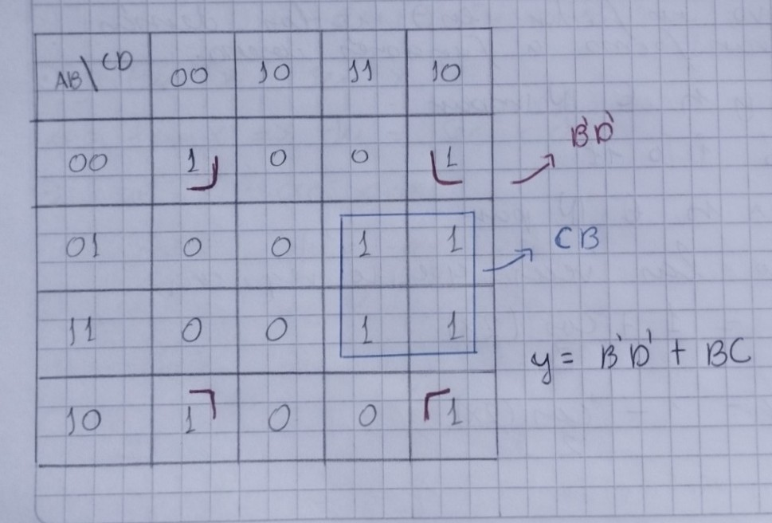
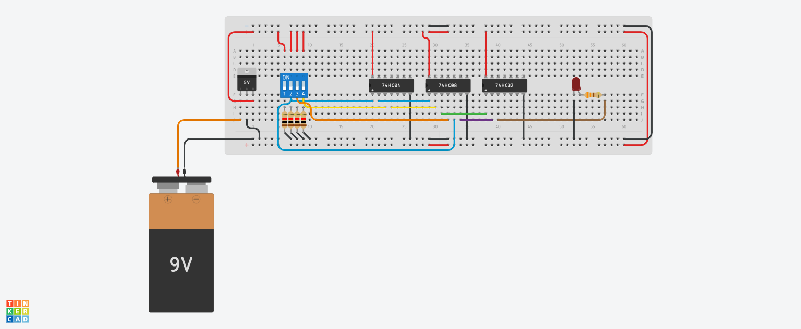
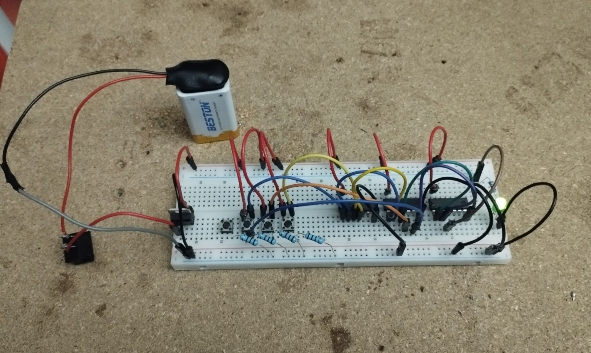

# Operation Vaultbreaker — Análisis lógico de la bóveda

## 1. Interpretación de la clave

$$y = \sum m(0,2,6,7,8,10,14,15)$$

El minitérmino más alto es 15 = 2⁴−1, así que el sistema tiene **4 variables de entrada**: A, B, C, D

 

## 2. Tabla de verdad

| # | A | B | C | D | y |
|---|---|---|---|---|---|
| 0  | 0 | 0 | 0 | 0 | **1** |
| 1  | 0 | 0 | 0 | 1 | 0 |
| 2  | 0 | 0 | 1 | 0 | **1** |
| 3  | 0 | 0 | 1 | 1 | 0 |
| 4  | 0 | 1 | 0 | 0 | 0 |
| 5  | 0 | 1 | 0 | 1 | 0 |
| 6  | 0 | 1 | 1 | 0 | **1** |
| 7  | 0 | 1 | 1 | 1 | **1** |
| 8  | 1 | 0 | 0 | 0 | **1** |
| 9  | 1 | 0 | 0 | 1 | 0 |
| 10 | 1 | 0 | 1 | 0 | **1** |
| 11 | 1 | 0 | 1 | 1 | 0 |
| 12 | 1 | 1 | 0 | 0 | 0 |
| 13 | 1 | 1 | 0 | 1 | 0 |
| 14 | 1 | 1 | 1 | 0 | **1** |
| 15 | 1 | 1 | 1 | 1 | **1** |

 

## 3. Mapa de Karnaugh

| AB \ CD | 00 | 01 | 11 | 10 |
|---------|----|----|----|----|
| **00**  | 1  | 0  | 0  | 1  |
| **01**  | 0  | 0  | 1  | 1  |
| **11**  | 0  | 0  | 1  | 1  |
| **10**  | 1  | 0  | 0  | 1  |

 

 

---

### Agrupaciones en el mapa

**Grupo 1 — B'D' (4 celdas):** columnas CD=00 y CD=10 en las filas AB=00 y AB=10
. En los cuatro, **B=0 y D=0** se mantienen fijos. Entonces B' y D'.

**Grupo 2 — BC (4 celdas):** filas AB=01 y AB=11, columnas CD=11 y CD=10. En los cuatro, **B=1 y C=1** se mantienen fijos. Entonces C y B.

**A no aparece en la expresión final** — no influye en la apertura de la bóveda.

 

## 4. Función simplificada

$$y = B'D' + BC$$

 

## 5. Verificación de equivalencia (comparación exhaustiva)

| A | B | C | D | y original (Σm) | B'D' | BC | y = B'D'+BC | ¿Coincide? |
|---|---|---|---|---|---|---|---|---|
| 0|0|0|0| 1 | 1 | 0 | 1 | ✅ |
| 0|0|0|1| 0 | 0 | 0 | 0 | ✅ |
| 0|0|1|0| 1 | 1 | 0 | 1 | ✅ |
| 0|0|1|1| 0 | 0 | 0 | 0 | ✅ |
| 0|1|0|0| 0 | 0 | 0 | 0 | ✅ |
| 0|1|0|1| 0 | 0 | 0 | 0 | ✅ |
| 0|1|1|0| 1 | 0 | 1 | 1 | ✅ |
| 0|1|1|1| 1 | 0 | 1 | 1 | ✅ |
| 1|0|0|0| 1 | 1 | 0 | 1 | ✅ |
| 1|0|0|1| 0 | 0 | 0 | 0 | ✅ |
| 1|0|1|0| 1 | 1 | 0 | 1 | ✅ |
| 1|0|1|1| 0 | 0 | 0 | 0 | ✅ |
| 1|1|0|0| 0 | 0 | 0 | 0 | ✅ |
| 1|1|0|1| 0 | 0 | 0 | 0 | ✅ |
| 1|1|1|0| 1 | 0 | 1 | 1 | ✅ |
| 1|1|1|1| 1 | 0 | 1 | 1 | ✅ |

Las 16 filas coinciden → **la función simplificada es equivalente a la original.**

## 6. Implementación con compuertas (para el montaje en protoboard)

$$y = \overline{B}\cdot\overline{D} + B\cdot C$$

Se necesitan:
- 2 inversores (NOT) → para obtener B' y D'.
- 2 compuertas AND → una para B'·D', otra para B·C
- 1 compuerta OR → para sumar ambos términos.

Nota: **A no se conecta a ninguna compuerta** —

 

## 6. Implementación en Thinkercad

 

## 6. Implementación en Protoboard

