# Informe escrito Reglas básicas de Verilog HDL y Operaciones elementales con bits #

 

## Ejercicio 1 ##

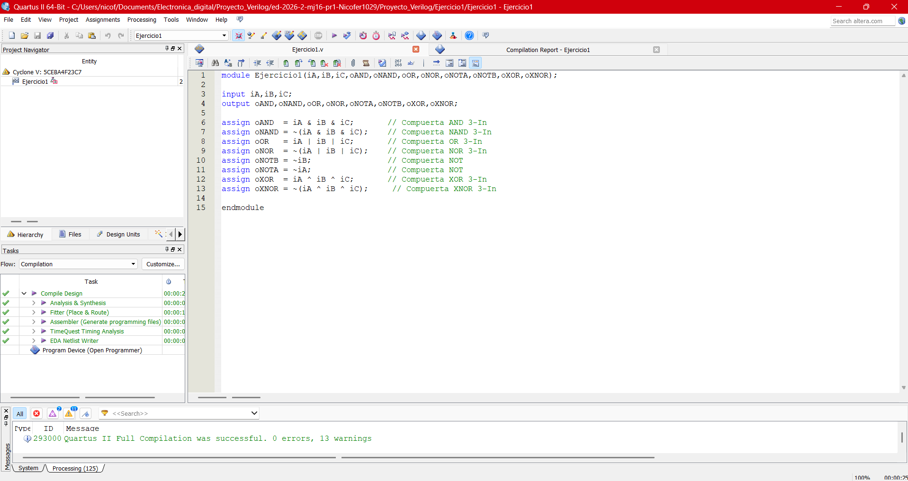

 

## Ejercicio 2 ##

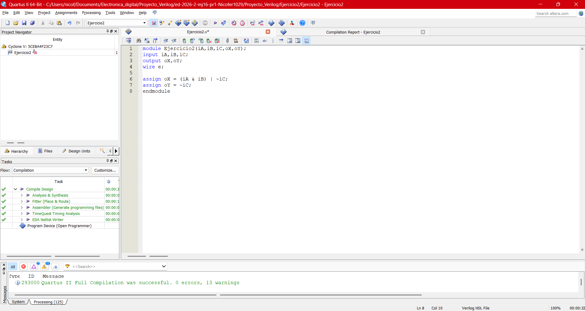

 

## Ejercicio 3 ##

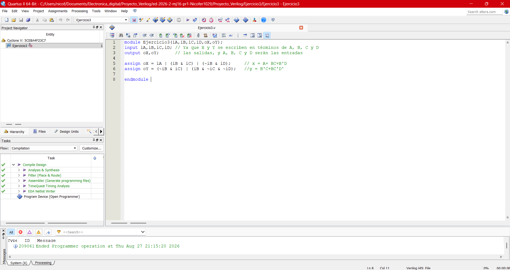

 

## Ejercicio 4 ##

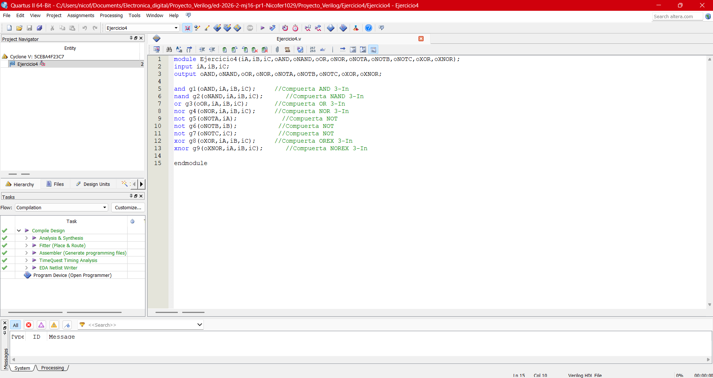

 

## Ejercicio 5 ##

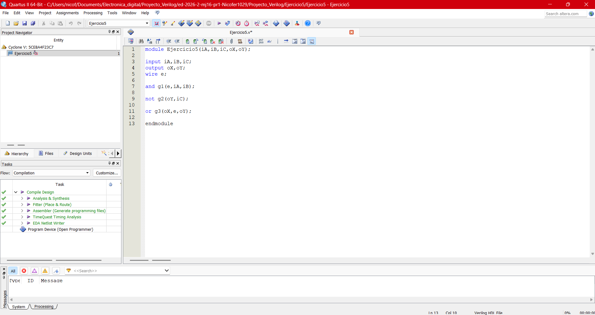

 

## Ejercicio 6 ##

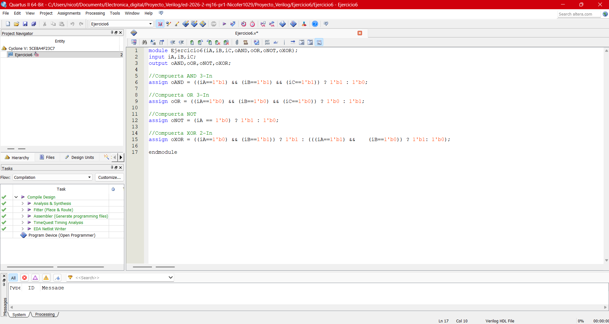

 

## Ejercicio 7 ##

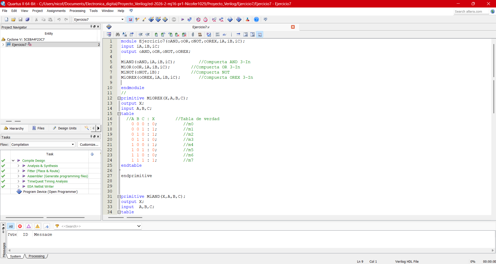

 

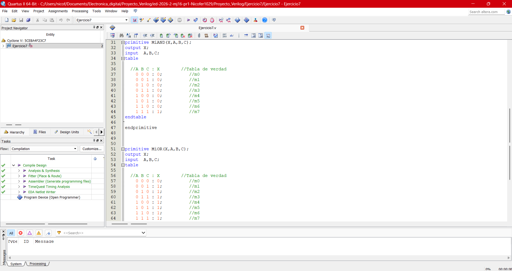

 

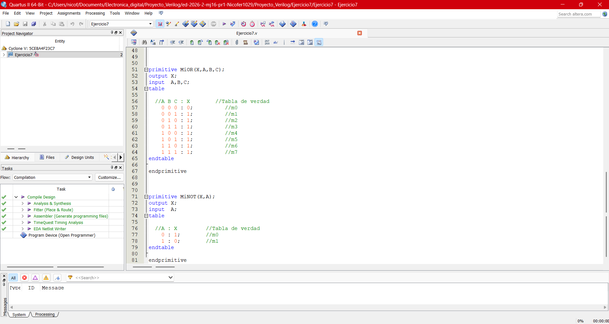

 

## Ejercicio 8 ##

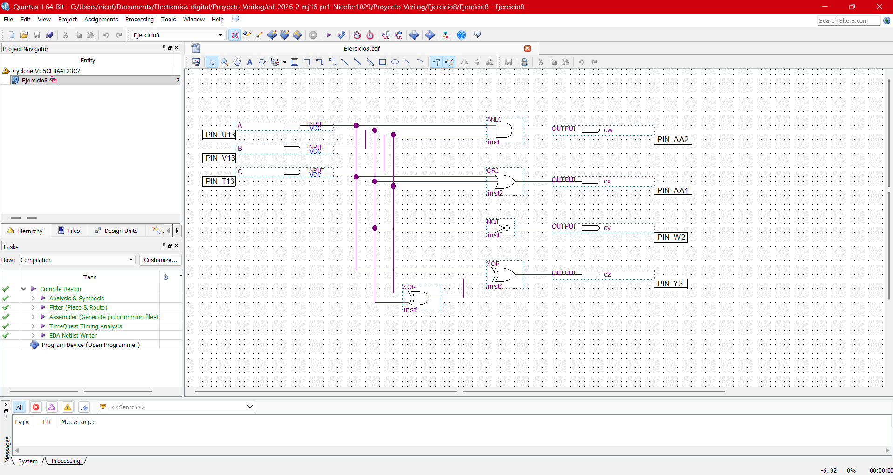

 

## Ejercicio 9 ##

### -> Esquematico ###

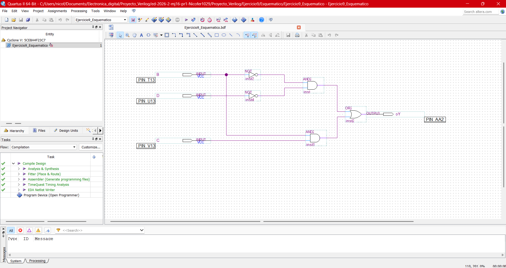

### -> Operadores Logicos ###

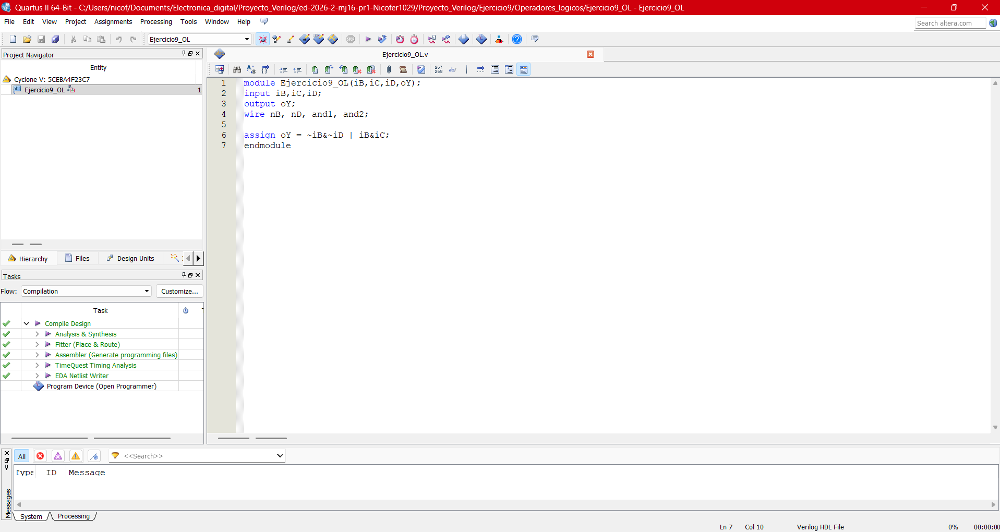

### -> Primitivas del sistema ###

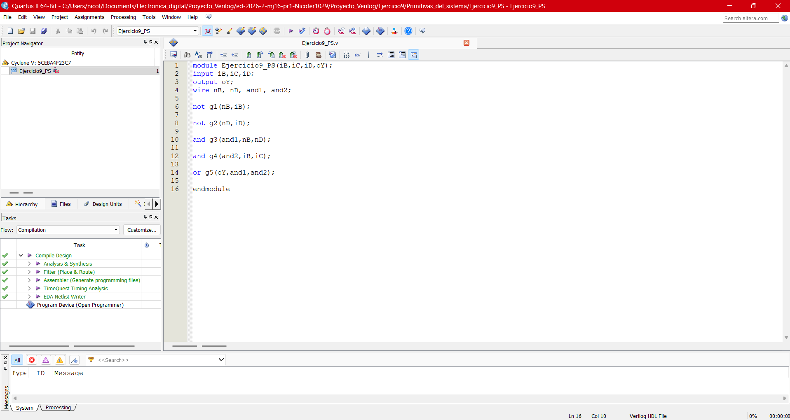

### -> Primitivas definidas por el usuario ###

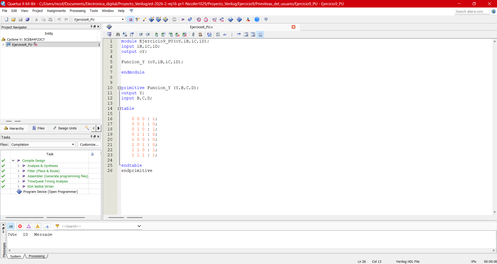

 

# Enlace al infome en video #

## -> https://www.youtube.com/watch?v=bYEfYxalE5c ##